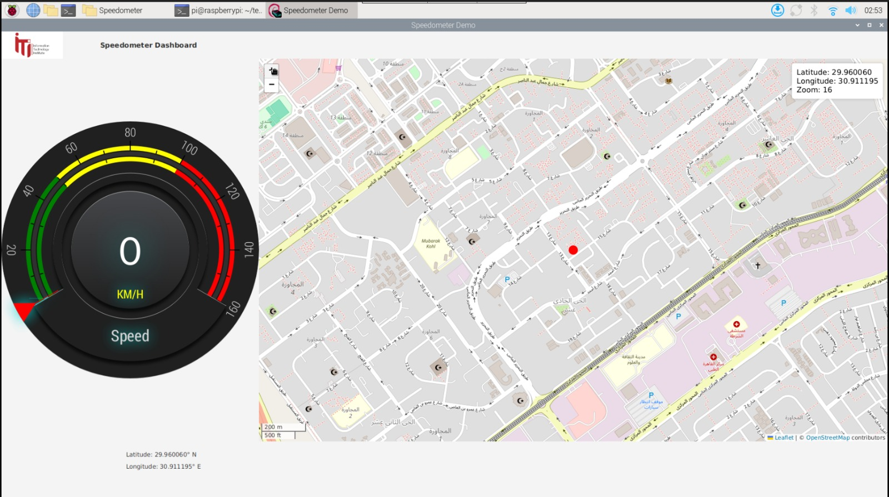

# JavaFX GPS Speedometer Dashboard (Raspberry Pi Edition)

## 📌 Project Overview
This project is a **JavaFX-based Speedometer Dashboard** designed to run on a **Raspberry Pi with Raspbian OS**. It connects to a **UART-based GPS module** (e.g., NEO-7M) via to display real-time **speed**, **latitude**, and **longitude**. Developed as part of our 9-month Embedded Systems training at ITI, it showcases a blend of hardware and software for vehicle dashboards or GPS tracking. Key features include:

- A dynamic speedometer gauge powered by the **Medusa library**.
- Live GPS coordinates and map visualization.
- Audio, pop-up, and disconnect alerts for safety.
- Remote monitoring via **VNC**.

The application is optimized for simplicity and efficiency on the Raspberry Pi.

---

## 🚀 Features
- 📡 **Real-time GPS Data**: Reads latitude, longitude, and speed from a GPS module using NMEA `$GPRMC` sentences.
- 🚗 **Live Speed Monitoring**: Displays speed in km/h on a customizable speedometer gauge (0-160 km/h, green: 0-50, yellow: 50-100, red: 100-160).
- 🗺 **Live Map Display**: Shows GPS coordinates on a web view map with a moving pin for real-time location tracking.
- ⚠ **Over-Speed Alerts**: Triggers an audio alarm and pop-up warning when speed exceeds 120 km/h.
- 🔌 **Disconnect Alerts**: Shows a pop-up if the GPS module is unplugged (e.g., TX wire removed).
- 🖥 **Raspberry Pi Compatible**: Runs on Raspbian with VNC for remote GUI access.

---

## 🔍 Main Implementation Points
- **UART GPS Parsing**: Processes `$GPRMC` NMEA frames to extract speed and coordinates.
- **Real-time UI Updates**: Updates the speedometer, labels, and map every 2 seconds using a background thread.
- **Custom Gauge**: Uses Medusa’s `Gauge` for a visually appealing speedometer with colored sections and a red needle.
- **Web View Map**: Integrates a `WebView` to display a live map with a moving pin based on GPS coordinates.
- **Alert System**: Combines audio playback (`alert.wav`), JavaFX `Alert` dialogs for over-speed, and pop-ups for GPS disconnects.
- **Clean Shutdown**: Closes UART connections, stops audio, and halts map updates on app exit.

---

### 📂 Project Structure

```
SpeedometerProject/
├── src/
│   ├── main/
│   │   ├── java/
│   │   │   ├── com.mycompany.speedometer/
│   │   │   │   ├── App.java              # JavaFX application entry point
│   │   │   │   ├── GPSData.java          # GPS data model and GPSReader manager
│   │   │   │   ├── GPSReader.java        # UART GPS data reader and parser
│   │   │   │   ├── PrimaryController.java # JavaFX UI controller
│   │   │   │   ├── SpeedAlarm.java        # Audio, pop-up, and disconnect alerts
│   │   └── resources/
│   │       ├── primary.fxml               # JavaFX UI layout (Scene Builder)
│   │       ├── alert.wav                  # Audio file for speed alert
└── pom.xml                                 # Maven configuration
```

## 🧱 Static UML Design
<p align='center'>

</p> 

---

## 🧱 Software Architecture
<p align='center'>

</p> 

##### See the Project Software Flow Chart:
[flowchart.md]()

---

## 🔌 Hardware Architecture
<p align='center'>

</p> 

---

## 🔁 Project Flow
1. **App Startup**:
   - `App` creates a `GPSReader` and starts UART communication on `/dev/ttyS0`.
   - Stores the `GPSReader` in `GPSData` for shared access.
   - Loads `primary.fxml` and initializes `PrimaryController`.

2. **GPS Data Reading**:
   - `GPSReader` opens `/dev/ttyS0` (9600 baud) and runs a thread to read NMEA `$GPRMC` sentences.
   - Parses speed (km/h), latitude, and longitude, updating `latestData` in `GPSReader`.

3. **UI Updates**:
   - `PrimaryController` runs a thread to fetch `latestData` from `GPSReader` (via `GPSData`) every 2 seconds.
   - Updates the speedometer gauge, coordinate labels, and web view map on the JavaFX thread.

4. **Speed and Disconnect Alerts**:
   - If speed > 120 km/h, `SpeedAlarm` plays `alert.wav` in a loop and shows a pop-up warning.
   - If the GPS module is unplugged (e.g., TX wire removed), a pop-up alerts the user.
   - Alerts stop when speed ≤ 120 km/h or GPS reconnects.

5. **Shutdown**:
   - `App.stop()` closes the UART connection, stops audio, and halts map updates.

---

## 🛠 Dependencies
Update your `pom.xml` with these dependencies:

```xml
<dependencies>
    <!-- JavaFX Modules -->
    <dependency>
        <groupId>org.openjfx</groupId>
        <artifactId>javafx-controls</artifactId>
        <version>17.0.1</version>
    </dependency>
    <dependency>
        <groupId>org.openjfx</groupId>
        <artifactId>javafx-fxml</artifactId>
        <version>17.0.1</version>
    </dependency>
    <dependency>
        <groupId>org.openjfx</groupId>
        <artifactId>javafx-web</artifactId>
        <version>17.0.1</version>
    </dependency>
    <!-- Medusa Gauge Library -->
    <dependency>
        <groupId>eu.hansolo</groupId>
        <artifactId>medusa</artifactId>
        <version>11.6</version>
    </dependency>
    <!-- jSerialComm for UART -->
    <dependency>
        <groupId>com.fazecast</groupId>
        <artifactId>jSerialComm</artifactId>
        <version>2.9.2</version>
    </dependency>
</dependencies>
```

---

## 🎛 Medusa Library
The **Medusa library**, developed by Hansolo (Gerrit Grunwald), is a powerful open-source Java library for creating customizable gauges in JavaFX applications. It’s ideal for real-time data visualization.

### Role in the Project
- **Speedometer Gauge**: Medusa’s `Gauge` class displays speed in km/h, configured with:
  - **Range**: 0 to 160 km/h.
  - **Sections**: Green (0-50), yellow (50-100), red (100-160) for quick feedback.
  - **Styling**: Red needle, black background, white values, gray UI background, and animated transitions.
- **Real-time Updates**: Updates every 2 seconds with speed data from `GPSReader`.

### Why Medusa?
- **Ease of Use**: Simplifies professional gauge creation.
- **Customization**: Supports `needleColor`, `sections`, and `unit` for aesthetic alignment.
- **Performance**: Lightweight for Raspberry Pi.

### Example Configuration
```java
speedometer.setMinValue(0);
speedometer.setMaxValue(160);
speedometer.setSections(
    new Section(0, 50, Color.GREEN),
    new Section(50, 100, Color.YELLOW),
    new Section(100, 160, Color.RED)
);
speedometer.setNeedleColor(Color.RED);
speedometer.setAnimated(true);
```

For more details, visit the [Medusa GitHub repository](https://github.com/HanSolo/Medusa).

---

## 📆 Flow of Execution
1. **`App.java`**:
   - Launches the JavaFX app, initializes `GPSReader`, and loads `primary.fxml`.
2. **`GPSReader.java`**:
   - Opens `/dev/ttyS0`, reads NMEA data in a thread, and updates `latestData`.
3. **`GPSData.java`**:
   - Stores parsed GPS data and provides access to the `GPSReader`.
4. **`PrimaryController.java`**:
   - Configures the speedometer and web view map.
   - Updates UI with speed, coordinates, and map every 2 seconds.
   - Triggers `SpeedAlarm` for speed or disconnect alerts.
5. **`SpeedAlarm.java`**:
   - Plays audio and shows pop-ups for speed > 120 km/h or GPS disconnects.
   - Stops alerts when conditions resolve.

---

## 📲 Functions Breakdown
1. **`App`**
   - **Role**: Launches the app, sets up `GPSReader`, loads the UI, and handles shutdown.
   - **Key Variables**: `scene` (static) - Manages the JavaFX UI.

2. **`GPSData`**
   - **Role**: Holds GPS data (speed, coordinates) and statically manages the `GPSReader`.
   - **Key Variables**: 
     - Instance: `speedKmh`, `latitude`, etc. - GPS data points.
     - Static: `reader` - Shared `GPSReader` instance.

3. **`GPSReader`**
   - **Role**: Reads UART data, parses `$GPRMC`, and updates `latestData`.
   - **Key Variables**: 
     - `serialPort` - UART connection.
     - `running` (volatile) - Thread control.
     - `latestData` - Latest GPS data.

4. **`PrimaryController`**
   - **Role**: Manages UI updates, map display, and alerts.
   - **Key Variables**: 
     - `speedometer`, `latitudeLabel`, `webView`, etc. (FXML) - UI elements.
     - `running` (volatile) - Update thread control.

5. **`SpeedAlarm`**
   - **Role**: Handles audio and pop-up alerts for speed > 120 km/h and GPS disconnects.
   - **Key Variables**: 
     - `SPEED_LIMIT` (static final) - 120 km/h threshold.
     - `isPlaying` (static) - Tracks alert state.
     - `clip` (static) - Audio playback.
     - `speedAlert`, `disconnectAlert` (static) - Pop-up dialogs.

---

## 📅 How to Build & Run

### 1. Install Java with JavaFX
- Use **SDKMAN!** to install Java 17 with JavaFX:
```bash
curl -s "https://get.sdkman.io" | bash
# Open a new terminal
sdk install java 17.0.1.fx-zulu
java -version  # Should show OpenJDK 17 with JavaFX
sudo apt install maven
```

### 2. Clone & Install Dependencies
```bash
git clone <your-repo-url>  # Replace with your actual repo URL
cd SpeedometerProject
mvn clean install
```

### 3. Connect GPS to Raspberry Pi
| GPS Pin | RPi Pin  |
|---------|----------|
| VCC     | 5V       |
| GND     | GND      |
| TX      | GPIO 15 (RXD) |
| RX      | GPIO 14 (TXD) |

Enable UART and VNC:
```bash
sudo raspi-config
# Interface Options > Serial Port > No console, Yes UART
# Interface Options > VNC > Yes
sudo reboot
```

### 4. Run the App on Raspberry Pi
```bash
cd SpeedometerProject
sudo mvn javafx:run
```

### 5. View GUI Remotely with VNC
- Find the Raspberry Pi’s IP:
```bash
ifconfig  # Look for wlan0 or eth0 IP, e.g., 192.168.1.100
```
- On your remote device (e.g., laptop):
```bash
vncviewer <rpi-ip>  # e.g., vncviewer 192.168.1.100
```

---

## 🚫 Alerts
- **Over-Speed Alert**:
  - **Trigger**: Speed > 120 km/h.
  - **Audio**: Plays `alert.wav` in a loop.
  - **Pop-up**: Shows a JavaFX `Alert` with "Speed Limit Exceeded" message.
  - **Stop**: Audio and pop-up stop when speed ≤ 120 km/h.
- **Disconnect Alert**:
  - **Trigger**: GPS module unplugged (e.g., TX wire removed).
  - **Pop-up**: Shows a JavaFX `Alert` with "GPS Disconnected" message.
  - **Stop**: Pop-up closes when GPS reconnects.

---

## 🎉 Final Outcome
- Real-time speedometer, GPS coordinates, and live map display.
- UART-based GPS parsing (`$GPRMC`).
- Audio, visual, and disconnect alerts for safety.
- Remote monitoring via VNC on Raspberry Pi.
- Ideal for vehicle dashboards or GPS tracking.
<p align='center'>

</p>

---

## 📚 References
- [StringBuilder](https://docs.oracle.com/javase/8/docs/api/java/lang/StringBuilder.html)
- [StringBuilder Tutorial](https://www.tpointtech.com/stringbuilder-in-java)
- [AudioInputStream](https://docs.oracle.com/javase/8/docs/api/javax/sound/sampled/AudioInputStream.html)
- [jSerialComm](https://github.com/Fazecast/jSerialComm)
- [InputStream](https://docs.oracle.com/javase/8/docs/api/java/io/InputStream.html)
- [BufferedInputStream](https://docs.oracle.com/javase/8/docs/api/java/io/BufferedInputStream.html)
- [JavaFX Alert](https://docs.oracle.com/javase/8/javafx/api/javafx/scene/control/Alert.html)
- [JavaFX WebView](https://docs.oracle.com/javase/8/javafx/api/javafx/scene/web/WebView.html)

---

## ✨ Authors & Acknowledgments
- **Developed by**: [Mohamed Awadin](https://github.com/MohamedAwadin), [Fatma Yosry](https://github.com/fatma-Elzeny), [Omar Alaa](https://github.com/OmarAlaa8184)
- **Acknowledgments**:
  - A massive thank you to our incredible team for their relentless dedication, brilliant ideas, and unstoppable spirit in making this project shine.
  - Huge gratitude to **Eng. Youssef Nofal**, Head of Embedded System Track, for his expert guidance in mastering embedded systems.
  - Special thanks to **Eng. Ahmed Mazen**, Mobile Applications Development Stream Manager at JETS-ITI, for his insightful feedback that turned our project into a true real-world product.

---
